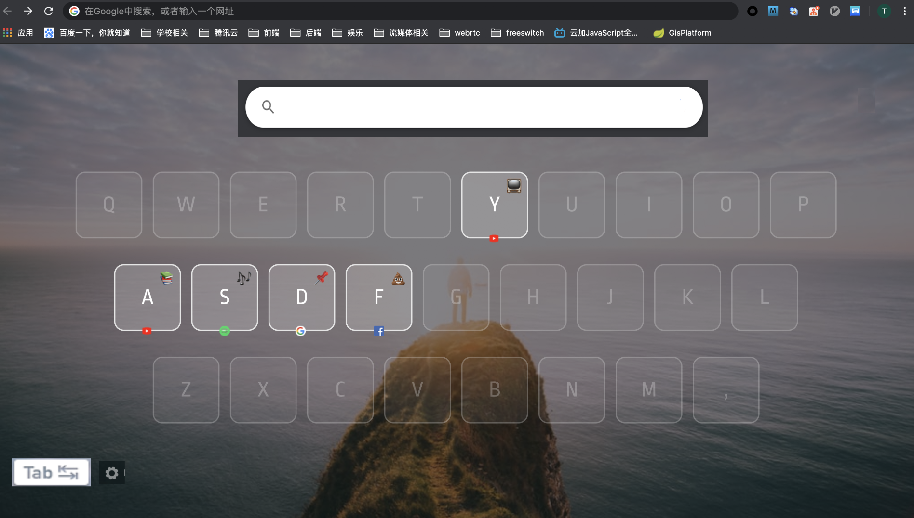
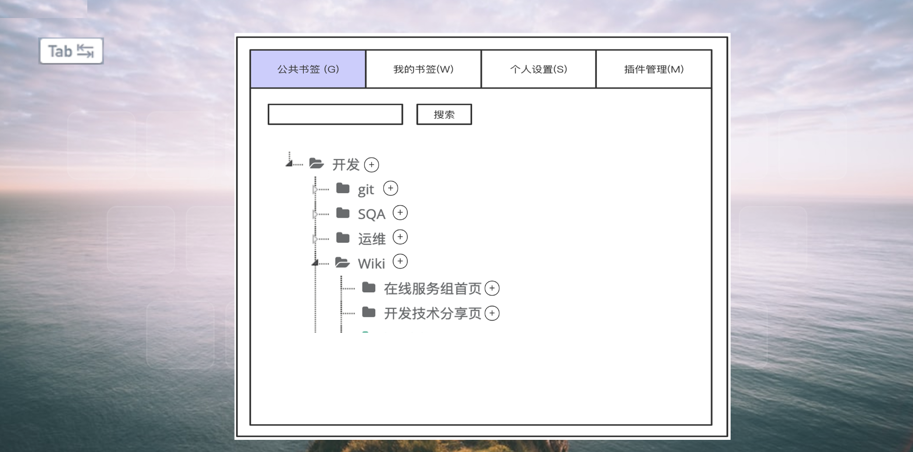
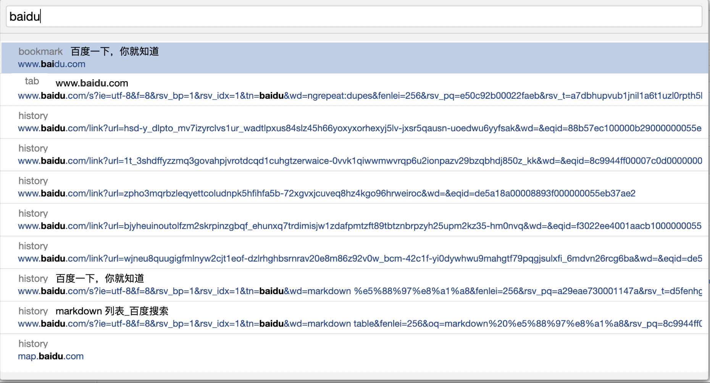
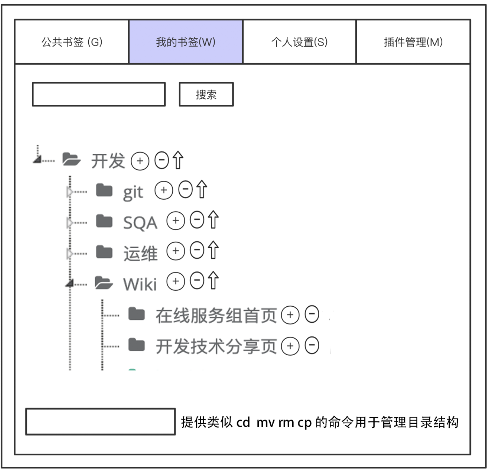

# 需求文档 
修改历史: 
|  人员   | 时间  |  编辑类型 |
|  ----  | ----  | ----   |
| 谢天帝  | 05/07 | 创建    |
|        |       |        |
  
## 核心需求

+ 一款后台可配置、管理的Chrome页面导航插件. 配置完成后可以科室共用
+ 简捷、快速的操控体验. 脱离鼠标, 纯键盘完成所有导航功能

## UI & UX
插件提供两个主要页面: 插件操作页 & 插件管理页. 两个页面 按Tab键切换

点击Chrome新建标签页, 默认直接进入插件操作页
    

点击Tab后, 进入管理页, 再次点击tab,回到操作页
    

1. 插件操作页面提供: 搜索框、按键绑定
    

+ 搜索框: 提供页面搜索功能, 输入文本后默认展出10项匹配的页面链接, 搜索内容从后台书签库、本地书签、当前已打开的Tab页、本地搜索历史中获取. 展示顺序依次由高到低
    
在搜索页点击tab键可以逐个向下,选取希望跳转的链接地址
  
+ 按键绑定: 键盘按已绑定按键后直接跳转到配置的链接地址, 按未绑定按键弹出模态框搜索页, 从搜索页中输入要绑定的链接, 展示项逻辑同搜索框.  

2. 配置页面:需要提供纯按键的操控体验,自行设计 
    
   配置页面最终要实现以下几个基本功能:
   + 查看公共书签, 并添加到我的书签
   + 查看我的书签, 提供书签管理功能, 目录移动功能, 上传公共书签库的功能
    

   + 个人设置, 设置个人姓名、id等信息, 书签上传公共书签库时使用.
   + 插件管理, 提供快捷键管理功能(选做)
  
3. 其他操控需求:
   在Chrome任意页面, 按键o 呼出 命令输入框, 可以输入自定义命令完成 添加书签、打开书签、替换书签功能